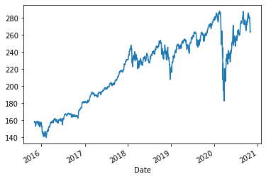
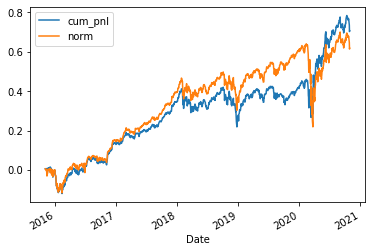

This program is a study on etf analysis strategy from the book <<以Python取勝 — 計量交易快速上手>>


```python
import pandas as pd
import numpy as np
import matplotlib.pyplot as plt
import matplotlib.dates as mdates
import yfinance as yf
import math
```

Download Dow Jones Industrial Average ETF data using yahoo finance api 


```python
data = yf.download(  # or pdr.get_data_yahoo(...
        # tickers list or string as well
        tickers = "DIA",

        # use "period" instead of start/end
        # valid periods: 1d,5d,1mo,3mo,6mo,1y,2y,5y,10y,ytd,max
        # (optional, default is '1mo')
        #period = "5y",
        start="2015-11-02", end="2020-10-30",

        # fetch data by interval (including intraday if period < 60 days)
        # valid intervals: 1m,2m,5m,15m,30m,60m,90m,1h,1d,5d,1wk,1mo,3mo
        # (optional, default is '1d')
        interval = "1d",

        # group by ticker (to access via data['SPY'])
        # (optional, default is 'column')
        group_by = 'ticker',

        # adjust all OHLC automatically
        # (optional, default is False)
        auto_adjust = True,

        # download pre/post regular market hours data
        # (optional, default is False)
        prepost = True,

        # use threads for mass downloading? (True/False/Integer)
        # (optional, default is True)
        threads = True,

        # proxy URL scheme use use when downloading?
        # (optional, default is None)
        proxy = None
    )
```

    [*********************100%***********************]  1 of 1 completed
    


```python
# check data quality
def conduct_eda(data_df):
    print(data_df.info())
    print(data_df.head())
    print(data_df.tail)
    data_df['Close'].plot()
conduct_eda(data)
```

    <class 'pandas.core.frame.DataFrame'>
    DatetimeIndex: 1258 entries, 2015-11-02 to 2020-10-29
    Data columns (total 5 columns):
     #   Column  Non-Null Count  Dtype  
    ---  ------  --------------  -----  
     0   Open    1258 non-null   float64
     1   High    1258 non-null   float64
     2   Low     1258 non-null   float64
     3   Close   1258 non-null   float64
     4   Volume  1258 non-null   int64  
    dtypes: float64(4), int64(1)
    memory usage: 59.0 KB
    None
                      Open        High         Low       Close   Volume
    Date                                                               
    2015-11-02  156.563526  157.820494  156.439600  157.670013  4178300
    2015-11-03  157.492949  158.980075  157.386731  158.510925  4284900
    2015-11-04  158.953639  158.971333  157.732072  158.139252  6870400
    2015-11-05  158.227681  158.670276  157.324784  158.130310  5008100
    2015-11-06  157.997554  158.599476  157.307107  158.572922  7642800
    <bound method NDFrame.tail of                   Open        High         Low       Close   Volume
    Date                                                               
    2015-11-02  156.563526  157.820494  156.439600  157.670013  4178300
    2015-11-03  157.492949  158.980075  157.386731  158.510925  4284900
    2015-11-04  158.953639  158.971333  157.732072  158.139252  6870400
    2015-11-05  158.227681  158.670276  157.324784  158.130310  5008100
    2015-11-06  157.997554  158.599476  157.307107  158.572922  7642800
    ...                ...         ...         ...         ...      ...
    2020-10-23  282.040126  282.129360  279.125031  280.939514  2161000
    2020-10-26  277.766703  278.014585  271.381259  274.653290  5140600
    2020-10-27  274.603676  274.722655  272.273580  272.333069  3029800
    2020-10-28  266.721033  268.456207  262.774741  263.230865  5815200
    2020-10-29  262.883829  266.661548  260.583477  264.331451  5479400
    
    [1258 rows x 5 columns]>
    





```python
def output_opt_result(data, clhl_start = 0.1, clhl_end = 1, clhl_step = 0.01, tc = 0.0005, min_trading_num=728):
    result = []
    data['r'] = data['Close'].pct_change()
    
    #try whole range of parameter in backtest
    for clhl_thres in np.arange(clhl_start, clhl_end + 0.00000001, clhl_step):
        try: 
            data['CLHL'] = (data['Close']-data['Low'])/(data['High']-data['Low'])
            data['position'] = np.where(data['CLHL']<clhl_thres, 1 ,0)
            data['tc'] = abs(data['position']-data['position'].shift(1))*tc
            data['pnl'] = data['position'].shift(1)*data['r']-data['tc']
            data['cum_pnl'] = data['pnl'].cumsum()
            trading_number = abs(data['position']).sum()
            SR = data['pnl'].mean()/data['pnl'].std()*math.sqrt(252)
            
            
        except:
            SR=-100
        if clhl_thres==0.88:
                print('teste')
                data.to_excel('data.xlsx')
        performance = {'CLHL_thres': clhl_thres, 'SR' : SR, 'trading_number':trading_number}
        result.append(performance)
        
    #optimise result
    result=pd.DataFrame(result)
    result_sort=result.sort_values('SR',ascending=False)
    result_sort.to_excel('sort.xlsx')
    result_sort = result_sort[result_sort['trading_number']>min_trading_num]
    clhl_opt = result_sort['CLHL_thres'].iloc[0]
    return clhl_opt
```


```python
clhl_opt=output_opt_result(data)
clhl_opt
```


    0.9699999999999995


```python
def apply_param(data,lclhl_opt,tc=0.0005):
    data['CLHL'] = (data['Close']-data['Low'])/(data['High']-data['Low'])
    data['position'] = np.where(data['CLHL']<clhl_opt, 1 ,0)
    data['tc'] = abs(data['position']-data['position'].shift(1))*tc
    data['pnl'] = data['position'].shift(1)*data['r']-data['tc']
    data['cum_pnl'] = data['pnl'].cumsum()
    data['norm'] = data['r'].cumsum()
    return data
```


```python
opt_data=apply_param(data,clhl_opt)
```


```python
conduct_eda(opt_data)
```

    <class 'pandas.core.frame.DataFrame'>
    DatetimeIndex: 1258 entries, 2015-11-02 to 2020-10-29
    Data columns (total 12 columns):
     #   Column    Non-Null Count  Dtype  
    ---  ------    --------------  -----  
     0   Open      1258 non-null   float64
     1   High      1258 non-null   float64
     2   Low       1258 non-null   float64
     3   Close     1258 non-null   float64
     4   Volume    1258 non-null   int64  
     5   r         1257 non-null   float64
     6   CLHL      1258 non-null   float64
     7   position  1258 non-null   int32  
     8   tc        1257 non-null   float64
     9   pnl       1257 non-null   float64
     10  cum_pnl   1257 non-null   float64
     11  norm      1257 non-null   float64
    dtypes: float64(10), int32(1), int64(1)
    memory usage: 122.9 KB
    None
                      Open        High         Low       Close   Volume         r  \
    Date                                                                            
    2015-11-02  156.563526  157.820494  156.439600  157.670013  4178300       NaN   
    2015-11-03  157.492949  158.980075  157.386731  158.510925  4284900  0.005333   
    2015-11-04  158.953639  158.971333  157.732072  158.139252  6870400 -0.002345   
    2015-11-05  158.227681  158.670276  157.324784  158.130310  5008100 -0.000057   
    2015-11-06  157.997554  158.599476  157.307107  158.572922  7642800  0.002799   
    
                    CLHL  position      tc       pnl   cum_pnl      norm  
    Date                                                                  
    2015-11-02  0.891027         1     NaN       NaN       NaN       NaN  
    2015-11-03  0.705557         1  0.0000  0.005333  0.005333  0.005333  
    2015-11-04  0.328567         1  0.0000 -0.002345  0.002989  0.002989  
    2015-11-05  0.598685         1  0.0000 -0.000057  0.002932  0.002932  
    2015-11-06  0.979453         0  0.0005  0.002299  0.005231  0.005731  
    <bound method NDFrame.tail of                   Open        High         Low       Close   Volume         r  \
    Date                                                                            
    2015-11-02  156.563526  157.820494  156.439600  157.670013  4178300       NaN   
    2015-11-03  157.492949  158.980075  157.386731  158.510925  4284900  0.005333   
    2015-11-04  158.953639  158.971333  157.732072  158.139252  6870400 -0.002345   
    2015-11-05  158.227681  158.670276  157.324784  158.130310  5008100 -0.000057   
    2015-11-06  157.997554  158.599476  157.307107  158.572922  7642800  0.002799   
    ...                ...         ...         ...         ...      ...       ...   
    2020-10-23  282.040126  282.129360  279.125031  280.939514  2161000 -0.001093   
    2020-10-26  277.766703  278.014585  271.381259  274.653290  5140600 -0.022376   
    2020-10-27  274.603676  274.722655  272.273580  272.333069  3029800 -0.008448   
    2020-10-28  266.721033  268.456207  262.774741  263.230865  5815200 -0.033423   
    2020-10-29  262.883829  266.661548  260.583477  264.331451  5479400  0.004181   
    
                    CLHL  position      tc       pnl   cum_pnl      norm  
    Date                                                                  
    2015-11-02  0.891027         1     NaN       NaN       NaN       NaN  
    2015-11-03  0.705557         1  0.0000  0.005333  0.005333  0.005333  
    2015-11-04  0.328567         1  0.0000 -0.002345  0.002989  0.002989  
    2015-11-05  0.598685         1  0.0000 -0.000057  0.002932  0.002932  
    2015-11-06  0.979453         0  0.0005  0.002299  0.005231  0.005731  
    ...              ...       ...     ...       ...       ...       ...  
    2020-10-23  0.603956         1  0.0000 -0.001093  0.766675  0.677880  
    2020-10-26  0.493272         1  0.0000 -0.022376  0.744299  0.655504  
    2020-10-27  0.024290         1  0.0000 -0.008448  0.735851  0.647056  
    2020-10-28  0.080283         1  0.0000 -0.033423  0.702428  0.613633  
    2020-10-29  0.616639         1  0.0000  0.004181  0.706609  0.617814  
    
    [1258 rows x 12 columns]>
    


```python
opt_data[['cum_pnl','norm']].plot()
```


    <matplotlib.axes._subplots.AxesSubplot at 0x18fe1145188>





```python

```
